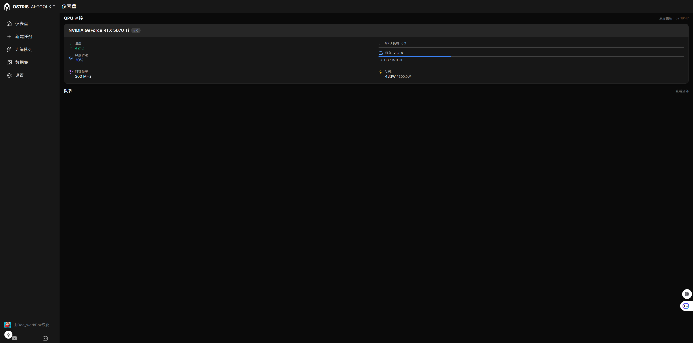
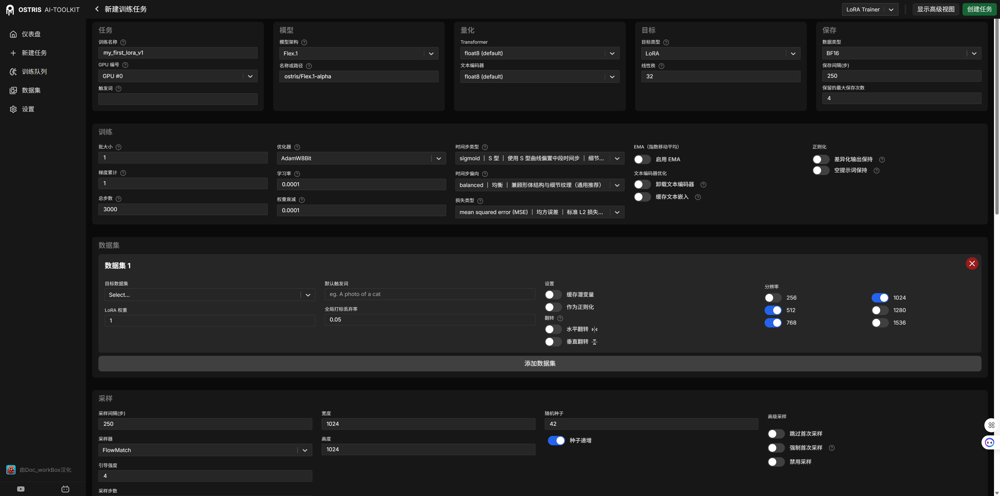
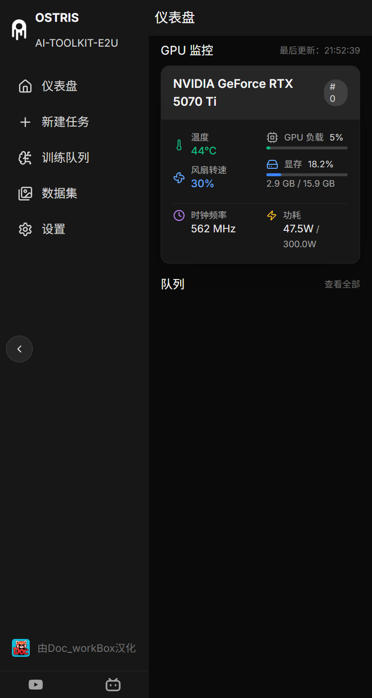
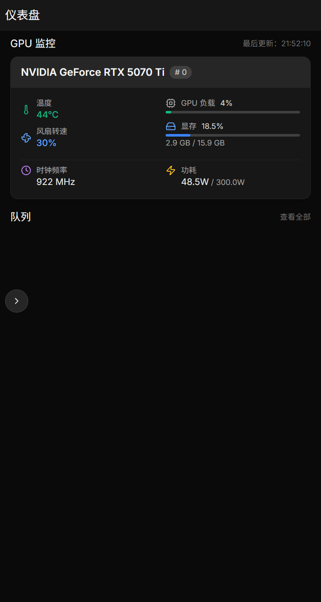

# 更易用的 AI Toolkit（中文 README）

本项目是 AI Toolkit 的中文与易用性优化版本（ai-toolkit-easy2use）。在保留原功能的基础上，聚焦「更易安装、更易上手、更易维护」。本 README 全文为中文，并对安装、运行与 UI 使用进行汉化说明。

> 原项目作者：Ostris；本仓库维护：DocWorkBox。

---

## 项目简介

- 面向扩散模型（Diffusion Models）的训练与推理一体化工具。
- 支持常见的图像与视频模型，适配消费级硬件。
- 提供命令行（CLI）与 Web 用户界面（UI），上手门槛低同时功能完备。

## 环境要求

- Docker Desktop（Windows/macOS）或 Docker Engine（Linux）
- **NVIDIA GPU + NVIDIA Container Toolkit**（必需，不支持 CPU 运行）
- Git（用于拉取仓库）
- 至少 20GB 可用磁盘空间（用于 Docker 镜像和模型）

> **重要提示**：本 Docker 镜像基于 NVIDIA CUDA，仅支持 GPU 运行，不支持纯 CPU 模式。

## Docker 部署（推荐方式）

### 方式一：使用预构建镜像（推荐）

直接使用 Docker Hub 上的预构建镜像，无需本地构建：

```bash
# 拉取最新镜像
docker pull coco1006/ai-toolkit-easy2use:latest

# 运行容器
docker run -d \
  --name ai-toolkit \
  --gpus all \
  -p 8675:8675 \
  -v ${PWD}/models:/models \
  -v ${PWD}/output:/output \
  -v ${PWD}/datasets:/datasets \
  coco1006/ai-toolkit-easy2use:latest
```

Windows PowerShell：

```powershell
# 拉取并运行
docker pull coco1006/ai-toolkit-easy2use:latest

docker run -d `
  --name ai-toolkit `
  --gpus all `
  -p 8675:8675 `
  -v "${PWD}/models:/models" `
  -v "${PWD}/output:/output" `
  -v "${PWD}/datasets:/datasets" `
  coco1006/ai-toolkit-easy2use:latest
```

### 方式二：本地构建镜像

如需自定义或使用最新代码，可本地构建：

#### 1）克隆仓库

```bash
git clone https://github.com/DocWorkBox/ai-toolkit-easy2use.git
cd ai-toolkit-easy2use
```

#### 2）构建 Docker 镜像

```bash
# 推荐（跨平台更稳，始终拉取最新基础镜像）
docker build --pull -t ai-toolkit-easy2use:0.7.2 -f docker/Dockerfile .

# 同时创建 latest 标签
docker tag ai-toolkit-easy2use:0.7.2 ai-toolkit-easy2use:latest
```

> 如需彻底禁用缓存（更慢但最干净）：`docker build --no-cache --pull -t ai-toolkit-easy2use:0.7.2 -f docker/Dockerfile .`

> 高级（可选）：不同终端的轻量缓存破坏示例
- Linux/macOS（Bash）：`docker build --build-arg CACHEBUST=$(date +%s) --pull -t ai-toolkit-easy2use:0.7.2 -f docker/Dockerfile .`
- Windows PowerShell：`docker build --build-arg CACHEBUST=$([DateTimeOffset]::UtcNow.ToUnixTimeSeconds()) --pull -t ai-toolkit-easy2use:0.7.2 -f docker/Dockerfile .`

> **注意**：首次构建可能需要 15-30 分钟，请耐心等待。

#### 3）运行本地构建的容器

```bash
# 运行容器
docker run -d \
  --name ai-toolkit \
  --gpus all \
  -p 8675:8675 \
  -v ${PWD}/models:/models \
  -v ${PWD}/output:/output \
  -v ${PWD}/datasets:/datasets \
  ai-toolkit-easy2use:latest
```

## 访问 Web UI

容器启动后，通过浏览器访问：

- `http://localhost:8675`（本地访问）
- `http://<your-ip>:8675`（远程访问）

## 目录挂载说明

- `/models`：存放 AI 模型文件（如 FLUX.1-dev 等）
- `/output`：训练输出和生成结果
- `/datasets`：训练数据集存放目录
- 容器内 Web UI 运行在端口 8675

## 容器运行选项

### 标准运行

```bash
docker run -d \
  --name ai-toolkit \
  --gpus all \
  -p 8675:8675 \
  -v ${PWD}/models:/models \
  -v ${PWD}/output:/output \
  -v ${PWD}/datasets:/datasets \
  coco1006/ai-toolkit-easy2use:latest
```

### Windows PowerShell 运行

```powershell
docker run -d `
  --name ai-toolkit `
  --gpus all `
  -p 8675:8675 `
  -v "${PWD}/models:/models" `
  -v "${PWD}/output:/output" `
  -v "${PWD}/datasets:/datasets" `
  coco1006/ai-toolkit-easy2use:latest
```

> **注意**：`--gpus all` 参数是必需的，因为镜像基于 CUDA，必须使用 GPU 运行。

## 容器管理命令

```bash
# 查看容器状态
docker ps

# 查看容器日志
docker logs ai-toolkit

# 停止容器
docker stop ai-toolkit

# 重启容器
docker restart ai-toolkit

# 删除容器
docker rm ai-toolkit

# 进入容器调试
docker exec -it ai-toolkit bash
```

## 目录挂载说明

- `/models`：存放 AI 模型文件（如 FLUX.1-dev 等）
- `/output`：训练输出和生成结果
- `/datasets`：训练集图片存放
- 容器内 Web UI 运行在端口 8675

## 传统安装方式（高级用户）

如果您不想使用 Docker，仍可按照传统方式安装：

<details>
<summary>点击展开传统安装步骤</summary>

### 环境要求
- Python ≥ 3.10
- CUDA ≥ 12.1
- PyTorch ≥ 2.4.0（CUDA 版本）
- NVIDIA GPU（显存需满足训练需求）
- Node.js ≥ 18
- Git

### 安装步骤
1. 克隆仓库：`git clone https://github.com/DocWorkBox/ai-toolkit-easy2use.git`
2. 创建 Python 虚拟环境：`python -m venv venv`
3. 激活虚拟环境：`venv\Scripts\activate`（Windows）或 `source venv/bin/activate`（Linux/macOS）
4. 安装 PyTorch（CUDA 版本）：`pip install torch torchvision torchaudio --index-url https://download.pytorch.org/whl/cu121`
5. 安装项目依赖：`pip install -r requirements.txt`
6. 构建并运行 UI：`cd ui && npm install && npm run build_and_start`

</details>

## 中文版 UI 截图




### 手机端 UI 截图




## 常见问题（FAQ）

- 显存不足如何处理？
  - 训练大型模型时，如遇显存限制，可在配置中开启低显存选项（例如 `low_vram: true`），或在 CPU 上量化部分模块以降低显存占用。
- Windows 环境安装遇到困难？
  - 建议优先确认 Python、CUDA 与驱动版本匹配；也可以考虑使用 WSL（Windows Subsystem for Linux）以获得更稳定的依赖环境。
- UI 无法访问或接口报错？
  - 请检查 Node.js 版本（≥18）、依赖是否安装完成（`npm install`）、以及开发服务器是否正常运行（`npm run dev`）。

## 致谢与说明

- 本仓库以更易用为目标进行中文化与体验优化，基于原 AI Toolkit 项目实现。
- 如需反馈问题或提交改进，欢迎在本仓库的 Issue 中留言。

---

## 目录指南（简要）

- `config/`：训练或推理相关配置示例与模板。
- `ui/`：Next.js 中文 UI 源码。
- `requirements.txt`：Python 依赖列表。
- 其他训练脚本、适配器与模型相关工具按模块分类存放。

---

## 许可证

本仓库遵循原项目的许可证政策（如有变更将于此处更新）。请在商用或分发前确认模型及数据集的独立许可证要求。
