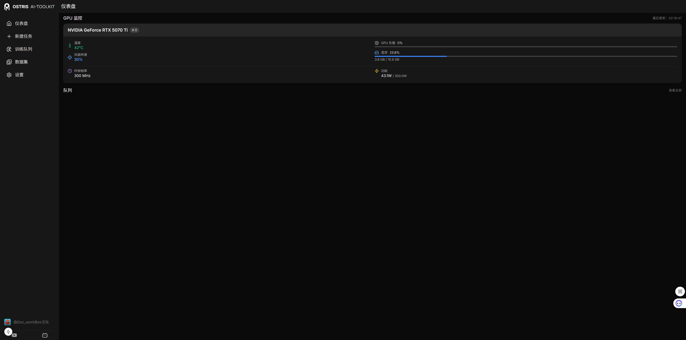
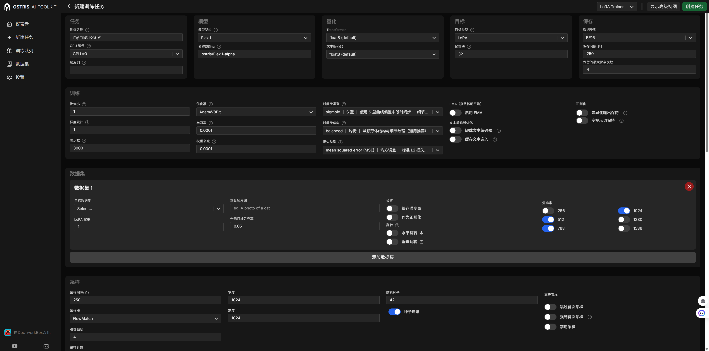
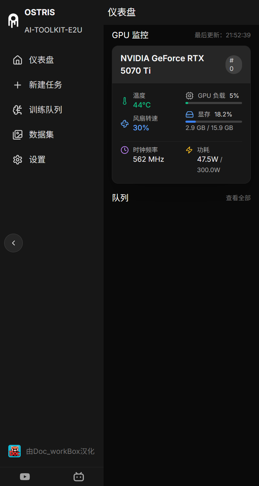
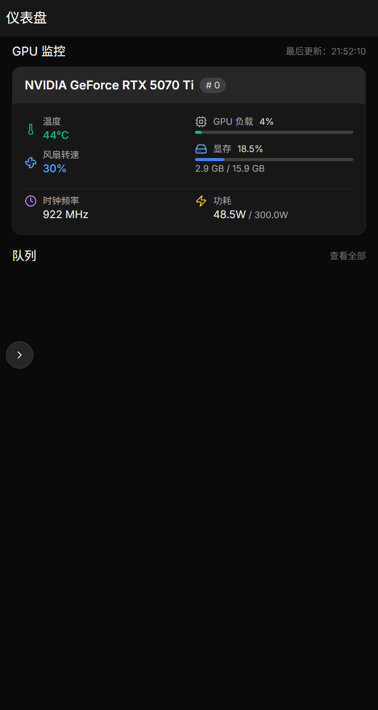

# 更易用的 AI Toolkit（中文 README）

本项目是 AI Toolkit 的中文与易用性优化版本（`ai-toolkit-easy2use`）。在保留原功能的基础上，聚焦「更易安装、更易上手、更易维护」。本 README 全文为中文，并对安装、运行与 UI 使用进行汉化说明。

> 原项目作者：Ostris；本仓库维护：DocWorkBox。

---

## 项目简介

- 面向扩散模型（Diffusion Models）的训练与推理一体化工具。
- 支持图像、视频、音频模型，以及编辑 / instruction 类模型。
- 提供命令行（CLI）与 Web 用户界面（UI），上手门槛低同时功能完备。
- 本仓库持续跟进上游更新，同时保留中文文档、中文 UI 和更贴近中文用户的使用体验。

## 当前支持概览

- 图像：FLUX.1 / FLUX.2 / FLUX.2 Klein / Qwen-Image / Qwen-Image-2512 / Z-Image / SDXL / SD1.5 / ERNIE-Image / Nucleus-Image / Krea 2 / Mage-Flow 等
- 编辑：Qwen-Image-Edit / Qwen-Image-Edit-2509 / Qwen-Image-Edit-2511 / HiDream E1 / FireRed-Image-Edit-1.1 / Mage-Flow Edit 预设
- 视频：Wan 2.x / LTX-2 / LTX-2.3 / MiniMax-H3 等
- 音频：ACE-Step 1.5 / ACE-Step 1.5 XL
- 实验性：Zeta-Chroma 等

## 环境要求

- Python >= 3.10（推荐 3.12）
- Git
- Python 虚拟环境
- Node.js >= 20（运行 Web UI）
- NVIDIA GPU（按训练任务准备足够显存）

### Mac Apple Silicon

上游已加入 Apple Silicon 的实验性支持。若你在 macOS 上使用，可直接尝试：

```bash
chmod +x run_mac.zsh
./run_mac.zsh
```

如果你在 Mac 上遇到兼容性问题，欢迎优先参考上游最新 issue 或在本仓库反馈。

## 安装（Linux / Windows）

### 1）克隆仓库

```bash
git clone https://github.com/DocWorkBox/ai-toolkit-easy2use.git
cd ai-toolkit-easy2use
```

### 2）创建并激活虚拟环境

Linux / macOS：

```bash
python3 -m venv venv
source venv/bin/activate
```

Windows（PowerShell）：

```powershell
python -m venv venv
.\venv\Scripts\Activate.ps1
```

### 3）安装 PyTorch（示例：CUDA 12.8）

请根据你的 CUDA / 驱动环境调整版本。以下为当前仓库推荐示例：

```bash
pip install --no-cache-dir torch==2.9.1 torchvision==0.24.1 torchaudio==2.9.1 --index-url https://download.pytorch.org/whl/cu128
```

### 4）安装项目依赖

```bash
pip install -r requirements.txt
```

### 5）DGX OS

DGX OS 设备请参考仓库内的 DGX 说明，并使用：

```bash
pip install -r dgx_requirements.txt
```

## 运行 UI（中文界面）

UI 为基于 Next.js 的 Web 应用。训练任务本身不依赖 UI 持续前台运行，UI 主要用于创建、启动、停止和监控任务。

### 旧版本升级到新版（重要）

如果你是从旧版本直接 `git pull` 到新版本，而不是全新安装，请务必在启动 UI 前同步 Prisma Client 和本地数据库结构。

这是因为上游更新会不定期修改 [`ui/prisma/schema.prisma`](ui/prisma/schema.prisma)。如果代码已经更新，但还没有重新生成 Prisma Client / 执行 `db push`，就可能出现这类问题：

- 页面加载时报 `Application error` 或 client-side exception
- 创建 / 保存任务失败
- 接口报 Prisma 字段不存在，例如 `Unknown argument job_ref`

推荐升级步骤：

```bash
cd ui
npm install
npm run update_db
npm run build
```

其中：

- `npm run update_db` 会执行 `npx prisma generate && npx prisma db push`
- `prisma generate` 用于重建 Prisma Client
- `prisma db push` 用于把本地 SQLite 数据库结构同步到最新 schema

如果你当前已经在运行 UI，请先停止正在运行的 `node` / `next` 进程，再执行上面的命令；否则在 Windows 下可能会遇到 Prisma DLL 被占用、无法更新的问题。

### 开发模式

```bash
cd ui
npm install
npm run dev
```

访问：

- `http://localhost:3000/`
- `http://localhost:3000/dashboard`
- `http://localhost:3000/jobs/new`

### 生产模式

```bash
cd ui
npm run build_and_start
```

默认端口：

- `http://localhost:8675`
- `http://<your-ip>:8675`

### 安全建议

如果你把 UI 暴露在公网，建议设置认证令牌：

```bash
# Linux
AI_TOOLKIT_AUTH=your_token npm run build_and_start

# Windows PowerShell
$env:AI_TOOLKIT_AUTH="your_token"; npm run build_and_start
```

## 近期已并入的重要上游能力

- MiniMax-H3 T2V / I2V 训练支持
- 新增跨平台环境 manager、Windows 无窗口启停和 NVIDIA Spark 构建支持
- 视频 latent 多线程预处理、AV1/PyAV 解码回退和无音轨视频兼容
- 新增 ConvRot/NVFP4/uintx 量化链路，并改进 LoRA 合并往返精度
- Mage-Flow / Mage-Flow Edit 训练支持
- 视频帧顺序解码、视频像素空间 `uint8` 缓存与样本缩略图优化
- Qwen Image 原生增加 `1328` 分辨率支持
- 新增 `ERNIE-Image` 与 `Nucleus-Image` 模型支持
- Flux2 / Flux2 Klein 低显存加载、量化顺序和控制图编码修复
- `compile: true` 真正生效，并修复 compile 时序
- 数据集页支持 duplicate dataset、改进拖拽 / 上传模型、隐藏文件过滤
- 数据集自动 caption、音频数据集 captioning、音频样本下载
- ACE-Step 1.5 / XL 音频模型支持
- `flac` / `ogg` 支持
- Light Mode 支持
- `AdvancedPromptEmbeds` 引入，增强 prompt/embed 兼容能力

## 中文版 UI 截图




### 手机端 UI 截图




## Windows 图形启动器

Windows 便携包可使用 `AI Toolkit Launcher.exe` 统一完成环境检查、安装、
依赖修复、程序更新、诊断以及 UI 的启动和停止。启动器只调用仓库内的
`python -m manager`，环境规则仍由当前版本的 manager 维护。

开发者可在仓库根目录执行：

```powershell
.\scripts\build_windows_launcher.ps1
```

默认产物位于 `dist/windows-launcher/<版本>/win-x64/`，为 Windows x64
自包含单文件，不要求用户预装 .NET。向便携包复制产物前，应先同步本次
版本的 `manager/` 代码，避免启动器界面与环境管理协议版本不一致。

部署到便携包时传入其根目录，脚本会同时复制匹配版本的 `manager/` 和
`AI Toolkit Launcher.exe`：

```powershell
.\scripts\build_windows_launcher.ps1 -PortableRoot C:\path\to\ai-toolkit-portable
```

启动器窗口底部会显示当前实际管理的根目录。环境状态来自完整诊断，
不是启动器自身所在机器能否找到任意 Python。

### 便携版更新分支

Windows 便携版代码由 `protable` 分支发布。便携包中的“检查更新”和
“执行更新”会查询并下载该分支的固定提交归档；更新时保留本地
`runtime/`、`models/`、`datasets/`、`output/`、数据库以及 UI 依赖和
构建缓存。启动器 EXE 会先暂存到 `.cache/portable-update/`，待下次启动时
完成自替换，避免覆盖正在运行的程序。

从第一次分支更新开始，更新状态会记录由该分支管理的代码文件。后续版本
删除代码时只清理这些已记录文件，不删除用户自行添加的文件。

便携版的“执行更新”只更新 `protable` 代码，不自动升级 Python、PyTorch
或其他环境依赖。环境差异由“环境诊断”显示，并通过“修复环境”按失败项
处理，避免正常可用的便携环境仅因建议版本变化而下载整套 PyTorch。

## FireRed-Image-Edit-1.1 预设说明

- 训练 UI 已新增 `FireRed-Image-Edit-1.1` 预设，适用于基于该模型的 LoRA 训练起步配置。
- 该预设复用当前仓库中的 `qwen_image_edit_plus` 兼容链路，底层按 `QwenImageEditPlusPipeline` 方式加载。
- 这是一份 ai-toolkit 风格预设，不是 FireRed 原仓 `train_lora.sh` 的逐项复刻；未直接映射的 FireRed 专属训练参数继续沿用 ai-toolkit 现有机制。
- 推荐优先从示例配置 `config/examples/train_lora_firered_image_edit_1_1_32gb.yaml` 启动，再按你的显存和数据集情况微调。

## 常见问题（FAQ）

- 显存不足如何处理？
  - 训练大型模型时，如遇显存限制，可在配置中开启低显存选项（如 `low_vram: true`），或对部分模块量化 / CPU 卸载。
- Windows 安装遇到困难？
  - 优先确认 Python、CUDA、驱动版本匹配；必要时建议使用 WSL 获得更稳定的依赖环境。
- UI 无法访问或接口报错？
  - 请确认 Node.js 版本（>=20）、依赖已安装完成，并检查 `npm run dev` / `npm run build_and_start` 是否正常启动。
- 旧版本升级后页面报错、数据集页打不开、保存任务失败？
  - 很多时候是 Prisma Client 或数据库结构没有同步。请进入 `ui/` 目录后执行：`npm install && npm run update_db && npm run build`。
- 想启用 Hugging Face 高速下载？
  - 可在启动前设置 `HF_HUB_ENABLE_HF_TRANSFER=1`。
- 音频 / 视频数据集读取失败？
  - 请检查 `ffmpeg`、`torchaudio` 与容器格式支持，必要时重新安装依赖并确认系统里可用的解码后端。

## 目录指南（简要）

- `config/`：训练或推理配置示例
- `ui/`：Next.js 中文 UI 源码
- `docs/docker/`：本仓库额外整理的 Docker 说明
- `requirements.txt` / `requirements_base.txt`：Python 依赖
- `dgx_requirements.txt`：DGX OS 专用依赖

## 致谢与说明

- 本仓库以更易用为目标进行中文化与体验优化，基于原 AI Toolkit 项目实现。
- 本仓库欢迎 issue、bug report 和改进建议。
- 自动化生成的 PR 请至少补充清晰的人类说明与验证结果，否则不建议直接合并。

## 许可证

本仓库遵循原项目的许可证政策。请在商用或分发前，额外确认模型、数据集和第三方依赖各自的许可证要求。
